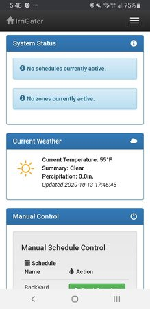
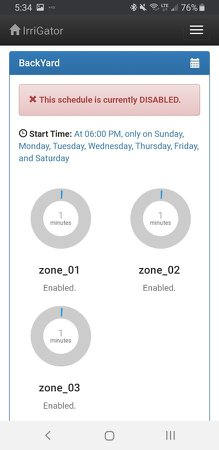
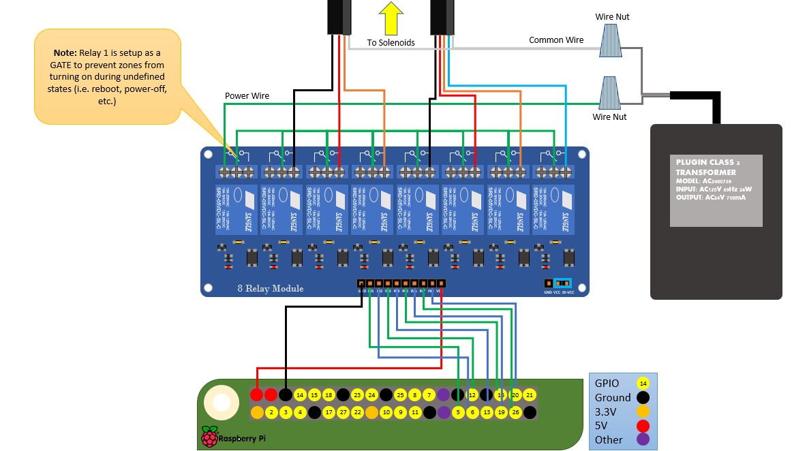
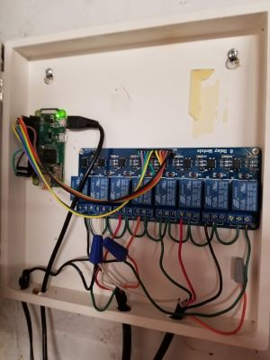
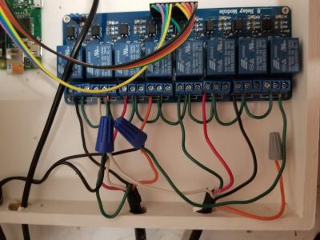
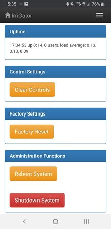
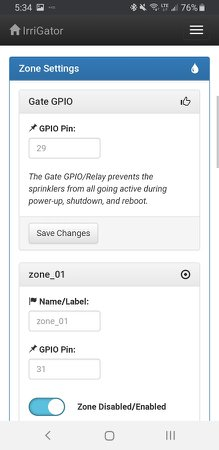
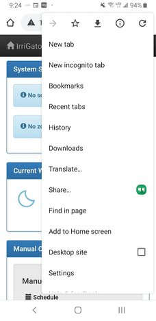
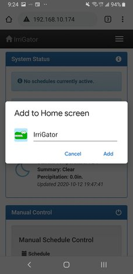
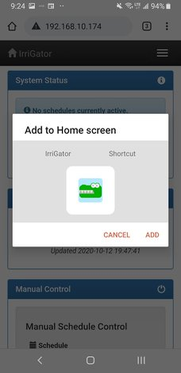

#  IrriGator

## Raspberry Pi Zero W or NTC CHIP based Smart Sprinkler Controller

This smart sprinkler controller allows you to setup your own custom sprinkler system using a Raspbery Pi, a 4+ channel relay, and 24V AC Power Supply.  If you have an existing sprinkler controller, it's likely you can swap in this project relatively easily, utilizing the existing power supply.  

__Features:__

* Manual Control of Zones and Schedules via WiFi / Network
* Custom Schedules, easily configured in the app from your smart phone or PC
* Weather Check / Percipitation Check - Cancel watering schedule if percipitation exceeds threshold.  
* Event Logging - Check history of schedules, whether any errors occurred, etc.  

__Screenshots:__

Dash / Schedules
  


#### Notes on this Project & Code Organization 

This project was actually created back in 2016, and is the reason that it is based on rather old versions of bootstrap, jquery, circliful, etc.  I was still very much learning when I created this project and much of it is pretty cring-worthy looking back at how it is organized.  With all that said, I said 'To heck with it!' and decided I should release this to the world anyway, in case anyone would value it. I've been running in my home since 2016 and it's worked nearly flawlessly the entire time. 

I've done a little big of clean-up to the code, modernizing it to use Python 3.x and so forth, but the large majority of it is original from when it was concieved. So please don't judge my poor design. :)

Initially this project used Flask's native WSGI services without Gunicorn or nginx as a proxy.  However, I noticed that after some time, the app would become unresponsive.  After a little research, it appears that Flask's built in web server is for testing purposes only and shouldn't really be used in production.  With that said, I'm using Gunicorn and nginx to proxy web resquests.  This is simple enough to configure and setup, however I had to redesign the application without the threading libraries, due to conflicts with Gunicorn.  Instead, I am using two processes running concurrently (control.py and app.py).  Control handles all of the RasPi GPIO interfaces, while App handles the web routes.  They communicate through a JSON file.

## Hardware Configuration

The hardware configuration for this project is relatively simple if you have an existing sprinkler system installed.  The setup of the sprinklers, the solenoids, and the wiring back to your panel is not in scope of this guide.  The focus here is to provide you with instructions on one working configuration. 

In a basic residential sprinkler configuration, you'll have indivdual valve solenoids to control each zone (which may contain several sprinklers).  These solenoids are actuated with two wires, commonly connected to a 24V AC power source.  When power is applied, the solenoid valve opens and the zone gets water.  

In a typical setup, you may have a thick cable that contains 5 wires that goes to a set of valves/solenoids.  One end of the solenoid would be connected to one of the four wire that would travel back to the controller, and one wire would be connected through a wire nut to the common wire, which travels back to the power supply.

Your mileage may vary, however, and your home sprinkler system might have some quirks (i.e. mine had different wire color for the common wire between the two cables coming into my house), different voltages etc.  This hardware may need some tweaks. 

### The Parts List

* **Raspberry Pi Zero W** - Technically any Raspberry Pi will do fine, but for this application a Raspberry Pi Zero W works really well (wifi is built right in)and is the right price.
* **8-Channel Relay** - Technically you can use any number of channels that you need (plus the gate channel), but in my setup I used this 8-channel relay for my zones. **Irrigator uses Active Low logic**, so ensure you get an Active Low or Low Trigger relay.  You can also modify the code in control.py to reverse the logic if needed. [Amazon Link](https://www.amazon.com/dp/B0057OC5WK/ref=cm_sw_em_r_mt_dp_U_TktNCbPC5MVRB)
* **Micro SD Card** - Greater than 4GB is probably good.  
* **MicroUSB Power Adapter** - At least 1 amp current recommended.  
* **24V AC Power Supply / Brick** - I used the power supply from my old Toro sprinkler controller, which already had the leads spliced.  
* **Dupont Cables** - Female to Female for connecting your GPIOs to the relay board. Readily found on Amazon, etc.  
* **AC/DC Coverter [Optional]** - I just picked up a AC/DC converter that is capable of converting the 24V AC to a 5V DC input.  This allows me to remove the Raspberry Pi power supply and only use the 24V power brick for both the sprinkler solenoids and the Pi+Relays.  It's a little on the pricier side, but it cleans up your implementation by removing one more power-supply from the mix. [Amazon Link](https://www.amazon.com/gp/product/B00RE6QN4U)

### Raspberry Pi Default GPIO Mapping
(FYI, this project is using BOARD pin mapping, not BCM pin mapping.  This means you'll need to use the pin number of the 40-pin header on the Pi instead of the BCM GPIO numbering)
+ GPIOxx Relay 0 - Zone Gate - Pin 29 (BOARD)
+ GPIOxx Relay 1 - zone_01 - Pin 31 (BOARD)
+ GPIOxx Relay 2 - zone_02 - Pin 32 (BOARD)
+ GPIOxx Relay 3 - zone_03 - Pin 33 (BOARD)
+ GPIOxx Relay 4 - zone_04 - Pin 35 (BOARD)
+ GPIOxx Relay 5 - zone_05 - Pin 36 (BOARD)
+ GPIOxx Relay 6 - zone_06 - Pin 37 (BOARD)
+ GPIOxx Relay 7 - zone_07 - Pin 38 (BOARD)

### Schematics

Basic Wiring Schematic for the entire project.



### HW Install

I couple of photos of the hardware mounted in a painted project box.  Not really all that pretty or exciting, but it does the job.  

 

## Software Installation

### Raspberry Pi Zero Initial Headless Setup

Once you've burned/etched the OS image (I prefer to the Raspberry Pi OS Lite) onto the microSD card, connect the card to your working PC and you'll see the card being mounted as "boot". Inside this "boot" directory, you need to make 2 new files. You can create the files using a text editor editor.

+ Step 1: Create an empty file. You can use Notepad on Windows or TextEdit to do so by creating a new file. Just name the file `ssh`. Save that empty file and dump it into boot partition (microSD).

+ Step 2: Create another file name wpa_supplicant.conf . This time you need to write a few lines of text for this file. For this file, you need to use the FULL VERSION of wpa_supplicant.conf. Meaning you must have the 3 lines of data namely country, ctrl_interface and update_config

```
country=US
ctrl_interface=DIR=/var/run/wpa_supplicant GROUP=netdev
update_config=1

network={
    ssid="your_real_wifi_ssid"
    scan_ssid=1
    psk="your_real_password"
    key_mgmt=WPA-PSK
}
```

#### Power-On, Log In, and Run RasPi-Config (REQUIRED PRE-REQUISITE FOR AUTO-INSTALL)
Now you can power-up your Raspberry Pi with your microSD card inserted, and connect to it via SSH.  If you're on a Linux PC, use the command line connect to your Pi.

```
ssh pi@192.168.10.xxx
```

If you're on a Windows PC, you can use Putty to SSH to your Pi, or you can install the Windows Subsystem for Linux and install a Linux image like Ubuntu to run the above command.  

Once connected, you'll want to run raspi-config to get the system setup.  

```
sudo raspi-config
```

Once raspi-config is open, the following should be configured at a minimum.

1. Set locales (Always good practice.  For US English, I typically use EN UTF8)

2. Set timezone (This ensures you have the right time in your dashboard)

3. Replace Hostname with a unique hostname ('i.e. pifire')


### Automatic Software Installation (Recommended)

I've created a script to install this automatically, but it is in ALPHA testing.  Your mileage may vary, and if anything fails, you may just want to try running the manual steps below.  

*NOTE: Do not use SUDO when running these commands.  Permissions will be aquired automatically.*

After you've done the above steps to configure your raspberry pi, at the command line type the following:

```
curl https://raw.githubusercontent.com/nebhead/irrigator/main/auto-install/install.sh | bash
```

OR you may find that it is more reliable to download the script to your raspberry pi first, and execute directly.

```
wget https://raw.githubusercontent.com/nebhead/irrigator/main/auto-install/install.sh
bash install.sh
```

Follow the onscreen prompts to complete the installation.  At the end of the script it will reboot, so just be aware of this.  

### Manual Software Installation

*NOTE: This installation assumes that you install on the 'pi' user account, otherwise the supervisor portion of the install will likely fail.  If you are using a different user account, make sure you modify the correct folder structures in the supervisor configuration files.*

Let's start by setting up the /tmp folder in RAM.  On your Pi, open the fstab file for editing:

```
sudo nano /etc/fstab
```

Add the following line to the bottom of the file.  

```
tmpfs /tmp  tmpfs defaults,noatime 0 0
```

Save and exit.  

#### Install Git, Python PIP, Flask, Gunicorn, nginx, and supervisord
```
sudo apt update
sudo apt install python3-dev python3-pip python3-rpi.gpio nginx git gunicorn supervisor -y
sudo pip install flask python-crontab cron-descriptor requests geopy
git clone https://github.com/nebhead/irrigator
```
#### Setup nginx to proxy to gunicorn
```
# Delete default configuration
sudo rm /etc/nginx/sites-enabled/default

# Copy configuration file to nginx
sudo cp irrigator.nginx /etc/nginx/sites-available/irrigator

# Create link in sites-enabled
sudo ln -s /etc/nginx/sites-available/irrigator /etc/nginx/sites-enabled

# Restart nginx
sudo service nginx restart
```

### Setup Supervisor to Start GarageZero on Boot / Restart on Failures

```
# Copy configuration files (control.conf, webapp.conf) to supervisor config directory
# NOTE: If you used a different directory for garage-zero then make sure you edit the *.conf files appropriately
sudo cp *.conf /etc/supervisor/conf.d/

# If supervisor isn't already running, startup Supervisor
sudo service supervisor start

# If supervisor is running already, just reload the config files
sudo supervisorctl reread
sudo supervisorctl update

# Or just reboot and supervisord should kick everything off
sudo reboot
```
Optionally, you can use supervisor's built in HTTP server to monitor the scripts.

Inside of /etc/supervisord.conf, add this:

```
[inet_http_server]
port = 9001
username = user
password = pass
```

If we access our server in a web browser at port 9001, we'll see the web interface that shows the status of the script WebApp.  This gives you a quick and easy way to monitor whether any of the scripts has stopped functioning.  

### Setup Crontab for other services

Add cron entries for items

 1. Add reboot script to initialize relays
  @reboot cd /home/pi/irrigator && sudo python3 control.py -i &

 2. Add monthly log cleanup
  @monthly cd /home/pi/irrigator/logs && sh backup.sh

 3. Add periodic weather check
  */15 * * * * cd /home/pi/irrigator && sudo python3 openwx.py

I've included an easy script to take care of thsi for you:

```
cd ~/irrigator/auto-install
sudo python3 initcron.py
```

### NTC CHIP Setup (DEPRICATED)
_NOTE:_ The NTC Chip section has been depricated as I don't have the time or setup to test this configuration with Python3 or any of the newer libraries.  Consider these instructions as a rough guide. 

### Setup Wifi

>sudo ifconfig

Note the WLAN0 MAC address

>sudo nmtui

Select your network, password, activate

>sudo nano /etc/hostname

Replace Hostname with a unique hostname ('i.e. Irrigator')

Configure your router's DHCP server to recognize the hostname, mac address, and assign a unique IP address to the device

### CHIP No Limit Mode
If you're like me and want run your chip from a sufficiently powered wall wart, then you'll probably want to set No-Limit mode on your CHIP.  This allows more than 900mA to be drawn from the USB port, in case the device needs more power (which it probably will from time to time).  Normally this limit is in place to protect your host PC's USB port, but since we're using this port to power the CHIP from the wall outlet, it's OK to remove this limit.  Here's how you permanently remove the limit:

>sudo axp209 --no-limit
>sudo systemctl enable no-limit

### Install Locales and Set Timezone
>sudo apt-get update && sudo apt-get install locales && sudo dpkg-reconfigure locales && sudo locale-gen

You’ll get a large menu to select locales. Use the arrow keys to scroll down and spacebar to mark your location with an asterisk. It’s advised that you choose the location marked UTF8. Others are somewhat arcane edge cases! Hit return to continue.

>sudo dpkg-reconfigure tzdata

### Install Python PIP, Flask, Gunicorn, nginx
>sudo apt-get update

>sudo apt-get install python-pip nginx git gunicorn -y

>git clone https://github.com/nebhead/irrigator

>sudo pip install flask python-crontab cron-descriptor

### Install CHIP IO

> sudo apt-get update
> sudo apt-get install git build-essential python-dev python-pip flex bison chip-dt-overlays -y
> git clone git://github.com/xtacocorex/CHIP_IO.git
> cd CHIP_IO
> sudo python setup.py install
> cd ..

### Setup nginx to proxy to gunicorn
>sudo rm /etc/nginx/sites-enabled/default # Delete default configuration

>sudo cp irrigator.nginx /etc/nginx/sites-available/irrigator # Copy configuration file to nginx

>sudo ln -s /etc/nginx/sites-available/irrigator /etc/nginx/sites-enabled # Create link in sites-enabled

>sudo service nginx restart # Restart nginx

### Configure Crontab for boot
>sudo crontab -l > mycron

>echo "@reboot cd /home/chip/irrigator && sudo sh boot.sh &" >> mycron

>echo "0 0 1 * * cd /home/chip/irrigator/logs && sh backup.sh" >> mycron

>sudo crontab mycron

>rm mycron

### (OPTIONAL) CHIP Battery Auto-Shutdown

This script will check the level of a battery attached to the CHIP. This needs to be run as root due to the shutdown command.
This script does not have a loop internal to it and should be set to a cron job (preferably root cron) at a 5 or 10 minute interval.


>git clone https://github.com/xtacocorex/chip_batt_autoshutdown.git
>cd chip_batt_autoshutdown
>chmod +x chip_batt_autoshutdown.sh
>sudo cp ./chip_autoshutdown.sh /usr/bin/

If running the script manually, be sure to run with sudo

### Cron Job Setup

Edit the root crontab

>sudo crontab -e

For 5 Minute check, enter:
> */5 * * * * /usr/bin/chip_autoshutdown.sh >> /var/log/chip_batt.log 2>&1

For 10 Minute check, enter:

> */10 * * * * /usr/bin/chip_autoshutdown.sh >> /var/log/chip_batt.log 2>&1

Then do:

>sudo service cron restart

To check the status of the script:

>tail -f /var/log/chip_batt.log

## Using IrriGator
If you've configured the supervisord correctly, the application scripts should run upon a reboot.  Once the system is up and running, you should be able to access the WebUI via a browser on your smart phone, tablet or PC device.  

Simply navigate to the IP address of your device for example (you can usually find the IP address of your device from looking at your router's configuration/status pages). My router typically assigns IPs with prefixes of 192.168.10.XXX.  I'll use examples on my home network here, so you'll see URLs like: http://192.168.10.42  Yours may look different depending on your routers firmware/manufacturer (i.e. 10.10.0.XXX, etc.)

**Note:** It's highly recommended to set a static IP for your Pi in your router's configuration.  This will vary from manufacturer to manufacturer and is not covered in this guide.  A static IP ensures that you will be able to access your device reliably, without having to check your router for a new IP every so often.   

#### The Dashboard
The interface / webui is broken out several pages. The first is the dashboard view where you can check the current status of the system, and manually control schedules or zones. Clicking the IrriGator logo in the upper left will always take you back to the dashboard from whatever screen you are on.  


Not shown here, the manual controls allow you to start/stop any of the configured schedules or zones.  When clicking on the individual zones, you will be prompted to enter the duration (i.e. run time).  Clicking start will assume the standard 10 minute duration.  

Pressing the hamburger icon in the upper right of the interface, allows you to also access to the other screens.  (on the large screen version, the options will be spelled out in the title bar)

#### Admin Settings

In the admin settings page, you can perform admin actions.  These include resetting data (clear controls, factory reset) and reset/shutdown commands.



In addition to these controls, you'll see more information about the system hardware, uptime, licenses and attributions.

#### Settings Page

In the settings page, there are options to configure the weather settings (you must setup a free account with OpenWeatherMaps to obtain an API Key). 


Set the target system (default is NONE) to Raspberry Pi to utilize the Raspberry Pi system.  NTC CHIP was previously supported, but is now depricated (attempt at your own risk).  The NONE setting allows you to run on a PC for debug purposes. 



If you've modified the pin map, or have added or removed zones (or you want to disable a zone),  you can also do that in these settings.  This allows you to extend the system to as many zones as needed (assuming you have enough GPIOs to support). 

#### Schedule Page

In the schedule page, you can manage your schedules.  You may modify, add or delete schedules as needed.  After modifying a schedule, ensure that it has been properly saved by reviewing the data.


#### Adding the App to your Homescreen using Chrome on your Android Phone

If you are an Android person, you are likely to be using Chrome on your phone and can not only setup a link to the web-app on your homescreen, but it also makes the interface look like a native application.  Pretty cool right?  Well here's how you set this up, it's very simple.  

First, navigate to the instance of the application in your Chrome browser on your phone.  Remember, it's as easy as going to the IP address that was assigned to you device.  Then, from the Chrome drop-down menu in the upper right of the screen, select "Add to Home screen".  



Then, when the new dialog box pops up, you will have the opportunity to rename the application, or keep the default.



And there you have it, you've not only created a quick link to your web-app, but you've also created a pseudo application at the same time.



#### Additional Notes on Accessing the Application from Outside your Local Network

Please take the utmost care in considering options for exposing this application outside of your home network. Given that this application has very limited security built-in, anyone that is able to gain access to it directly or indirectly, may be able to control your hardware which could result in damage to your property or even potentially physical harm to someone nearby.  

If you want to have access to this application outside of your home network, and I haven't already convinced you not to do this, then I would recommend setting up a VPN for your local network.  This would allow you to tunnel to your home network and access all of your local equipment with some level of security.  A good, low cost, and dead simple VPN project I would recommend is [PiVPN](http://www.pivpn.io/).

### Credits

Web Application created by Ben Parmeter, copyright 2016-2020. Check out my other projects on [github](https://github.com/nebhead). If you enjoy this software and feel the need to donate a cup of coffee, a frosty beer or a bottle of wine to the developer you can click [here](https://paypal.me/benparmeter).

Of course, none of this project would be available without the wonderful and amazing folks below.  If I forgot anyone please don't hesitate to let me know.  

* **Circliful** - Beautiful Circle Gauges on the dashboard. Extra special mention for Patric for providing great support to me via GitHub.  Copyright Patric Gutersohn & other contributors. [gutersohn.com](http://gutersohn.com/) [github](https://github.com/pguso/js-plugin-circliful)

* **Bootstrap** - WebUI Based on Bootstrap 3.  Bootstrap is released under the MIT license and is copyright 2018 Twitter. [getbootstrap.com](http://getbootstrap.com)

* **JQuery** - Required by Bootstrap. Copyright JS Foundation and other contributors. Released under MIT license. [jquery.org/license](https://jquery.org/license/)

* **TitaToggle** - Used for toggles. Released under GNU General Public License v2.0 [github.io](http://kleinejan.github.io/titatoggle/)

* **WeatherUnderground Icons** - Borrowed icons from this GitHub repository for weather display on the dashboard.  Released under MIT license [github.com](https://github.com/manifestinteractive/weather-underground-icons). 

* **Glyphicons** - Nice collection of icons bundled with Bootstrap 3. Created by Jan Kovařík over at [GLYPHICONS](http://glyphicons.com)

### Licensing

This project is licensed under the MIT license.

```
MIT License

Copyright (c) 2020 Ben Parmeter

Permission is hereby granted, free of charge, to any person obtaining a copy
of this software and associated documentation files (the "Software"), to deal
in the Software without restriction, including without limitation the rights
to use, copy, modify, merge, publish, distribute, sublicense, and/or sell
copies of the Software, and to permit persons to whom the Software is
furnished to do so, subject to the following conditions:

The above copyright notice and this permission notice shall be included in all
copies or substantial portions of the Software.

THE SOFTWARE IS PROVIDED "AS IS", WITHOUT WARRANTY OF ANY KIND, EXPRESS OR
IMPLIED, INCLUDING BUT NOT LIMITED TO THE WARRANTIES OF MERCHANTABILITY,
FITNESS FOR A PARTICULAR PURPOSE AND NONINFRINGEMENT. IN NO EVENT SHALL THE
AUTHORS OR COPYRIGHT HOLDERS BE LIABLE FOR ANY CLAIM, DAMAGES OR OTHER
LIABILITY, WHETHER IN AN ACTION OF CONTRACT, TORT OR OTHERWISE, ARISING FROM,
OUT OF OR IN CONNECTION WITH THE SOFTWARE OR THE USE OR OTHER DEALINGS IN THE
SOFTWARE.
```